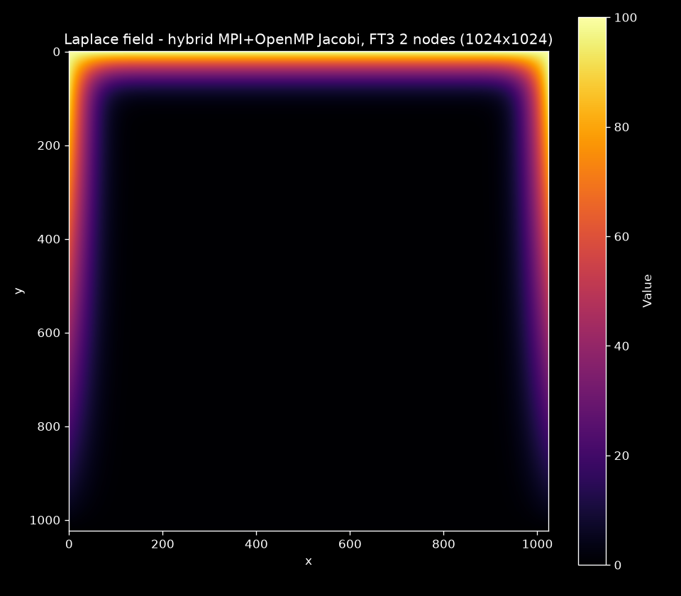

# hpc-parallel-algorithms


## Objective

A curated collection of parallel algorithms in C, developed and benchmarked as part of an MSc in High-Performance Computing. Workloads run on **CESGA FinisTerrae-3** (Galician Supercomputing Center) through Slurm. The repository demonstrates production-grade shared-memory (OpenMP) and distributed-memory (MPI) patterns with a focus on **low latency, cache-friendly access and measurable speedups**.

## Architecture

```text
┌────────────┐    ┌──────────┐    ┌─────────────┐    ┌──────────────┐
│  src/*.c   │───▶│ Makefile │───▶│  Slurm jobs │───▶│  benchmarks/ │
│ algorithms │    │ -O3/march│    │  sbatch/srun│    │  timings CSV │
└────────────┘    └──────────┘    └─────────────┘    └──────────────┘
```

- **`src/`** — self-contained algorithm implementations, each compiled independently.
- **`slurm/`** — job scripts capturing resource requests (CPUs per task, time, partition) for reproducible FinisTerrae-3 runs.
- **`benchmarks/`** — scaling results (strong/weak) exported as CSV and plotted.

## Tech Stack

| Layer | Technology |
|---|---|
| Language | C17 |
| Shared memory | OpenMP (reductions, static scheduling, per-thread RNG) |
| Distributed memory | MPI (hybrid row decomposition, halo exchange via Sendrecv) |
| Scheduler | Slurm (CESGA FinisTerrae-3) |
| Build | GNU Make, GCC (`-O3 -march=native`) |
| CI | GitHub Actions (build + smoke test) |

## Repository Layout

```text
hpc-parallel-algorithms/
├── src/
│   ├── monte_carlo_pi.c      # OpenMP Monte Carlo pi, per-thread PCG RNG seeding
│   ├── jacobi_2d.c           # hybrid MPI+OpenMP 2D Laplace solver, halo exchange
│   ├── gbm_engine.c          # OpenMP GBM engine: antithetic variates, Welford, bands CSV
│   ├── mpi_pingpong.c        # point-to-point latency/bandwidth benchmark
│   └── mpi_collectives.c     # collective benchmark: Bcast/Scatter/Gather/Reduce/Allreduce
├── slurm/
│   ├── monte_carlo_pi.slurm  # SBATCH: 1 node, 64 CPUs, 10 min
│   ├── jacobi_2d.slurm       # SBATCH: 2 nodes, 2x2 ranks, 32 CPUs each
│   └── gbm_engine.slurm      # SBATCH: 1 node, 64 CPUs, 15 min, 10^9 paths
├── benchmarks/
│   ├── plot_scaling.py       # CSV -> speedup/efficiency plots (dark mode)
│   ├── plot_field.py         # CSV field -> heatmap (dark mode)
│   └── sample_*              # illustrative data until FinisTerrae-3 runs land
├── labs/
│   └── mpi/                  # 12 hands-on MPI exercises (MSc coursework, FT3)
├── Makefile
└── .github/workflows/ci.yml
```

## Execution

### Local build and run

```bash
make all
./bin/monte_carlo_pi 100000000
# samples=100000000 threads=8 pi=3.14167618 abs_error=8.35e-05 wall_s=0.412
```

### CESGA FinisTerrae-3 (Slurm)

```bash
# scripts load the Intel toolchain (module load intel impi); default partition is short*
module load intel impi
make all CC=icc CFLAGS="-O3 -fopenmp -std=c17"
sbatch slurm/monte_carlo_pi.slurm
sbatch slurm/jacobi_2d.slurm
sbatch slurm/gbm_engine.slurm
squeue -u $USER
sacct -j <jobid> --format=JobID,Elapsed,NTasks,State
```

### Hybrid MPI + OpenMP (local)

```bash
mpirun -np 2 ./bin/jacobi_2d 256 10000 1e-4 field.csv
# n=256 ranks=2 threads_per_rank=8 iters=2763 residual=9.99e-05 converged=yes wall_s=0.214
```

The 2D Laplace solver decomposes the global grid by rows across MPI ranks; each rank sweeps its block with OpenMP and exchanges halo rows via `MPI_Sendrecv`. Convergence is tracked with `MPI_Allreduce` (max).

### GBM engine (local)

```bash
./bin/gbm_engine 100 0.08 0.25 252 100000000 benchmarks/gbm_bands.csv
# s0=100.00 mu=0.0800 sigma=0.2500 horizon=252 paths=100000000 threads=8
# exact_terminal_mean=... exact_terminal_std=...
# elapsed_s=... throughput_paths_per_s=...
```

Streams trajectories with **antithetic variates** (variance reduction), accumulates exact terminal statistics via Welford (merged per thread), and keeps a stride sample of full paths for per-day percentile bands. The CSV's `# key=value` metadata header is consumed by the Python bridge in [quant-trading-models](https://github.com/maezgonz/quant-trading-models) (`src/hpc_bridge.py`), which plots the bands in dark mode and cross-validates the engine against the NumPy kernel.

### MPI ping-pong benchmark (local)

```bash
mpirun -np 2 ./bin/mpi_pingpong
#      bytes      latency_us      bandwidth_GBps
#          1            0.85              0.001
#          2            0.88              0.002
#          ...
#    8388608         1850.00             22.670
```

Canonical ping-pong over increasing message sizes (1 B to 8 MiB): half-RTT latency and one-way bandwidth, characterizing the interconnect.

### MPI labs (MSc coursework)

Twelve hands-on exercises — point-to-point, collectives (`Bcast`, `Scatter`, `Reduce`, `Scan`, `Reduce_scatter`) and domain-decomposed integration — run on FinisTerrae-3 with the real job configuration in `labs/mpi/job_ft3.sh` (`module load intel impi`, 64 cores/node):

```bash
cd labs/mpi && make all
mpirun -np 4 ./example9_reduce

## Results

All results below are **real runs on CESGA FinisTerrae-3** (Intel icc 2021.3.0, Intel MPI 2021.3, InfiniBand fabric).

### Strong scaling — Monte Carlo pi (10⁹ samples, 1× 64-core node)

| Threads | Wall time (s) | Speedup | Efficiency | abs error |
|---:|---:|---:|---:|---:|
| 1 | 5.863 | 1.00× | 100% | 3.49e-05 |
| 8 | 0.735 | 7.98× | 99.7% | 6.35e-05 |
| 32 | 0.427 | 13.73× | 42.9% | 5.90e-05 |
| 64 | 0.333 | 17.60× | 27.5% | 7.72e-05 |

Near-perfect scaling to 8 threads; beyond that the kernel becomes memory-bandwidth bound. The varying absolute error per row reflects the distinct per-thread RNG streams.


### MPI ping-pong — inter-node latency and bandwidth (InfiniBand, 2 nodes)

| Bytes | RTT (µs) | Bandwidth (GB/s) |
|---:|---:|---:|
| 1 | 2.82 | 0.001 |
| 64 | 2.99 | 0.043 |
| 1024 | 4.72 | 0.434 |
| 32768 | 16.00 | 4.097 |
| 1048576 | 180.55 | 11.615 |
| 8388608 | 1370.16 | 12.245 |

Latency floor of **~2.8 µs** and a bandwidth plateau of **~12.2 GB/s** — the classic interconnect fingerprint.

### Collective communication (4 ranks × 8 threads, 2 nodes)

Average duration per call across message sizes (InfiniBand, 2 nodes):

| Bytes/rank | Bcast | Scatter | Gather | Reduce | Allreduce |
|---:|---:|---:|---:|---:|---:|
| 8 | 0.99 µs | 1.29 µs | 1.11 µs | 0.89 µs | 2.10 µs |
| 32 | 1.25 µs | 1.37 µs | 1.11 µs | 1.63 µs | 4.79 µs |
| 512 | 2.79 µs | 4.22 µs | 3.35 µs | 3.56 µs | 6.32 µs |
| 8192 | 15.72 µs | 14.23 µs | 6.19 µs | 13.08 µs | 17.71 µs |
| 131072 | 233.06 µs | 37.26 µs | 29.82 µs | 139.51 µs | 133.43 µs |
| 262144 | 221.29 µs | 70.89 µs | 64.17 µs | 262.14 µs | 260.69 µs |

Scatter/Gather stay cheapest at scale (tree algorithms on the fabric); Reduce/Allreduce pay the data-size cost of the reduction tree.

### Hybrid MPI + OpenMP — Laplace solver (1024×1024, 2 nodes × 2 ranks × 32 threads)

`n=1024 ranks=4 threads_per_rank=32 iters=5001 wall_s=0.181` — run across two physical nodes (c202-15, c202-16) with halo exchange over InfiniBand; the sweep is memory-bound at this grid size, so the efficiency report is dominated by the short wall time.



### Benchmark harness

Scaling results are analyzed automatically: feed a CSV of `(threads, wall_time)` pairs and the harness derives speedup, parallel efficiency and a markdown table ready for this README — rendered in dark mode.

```bash
python benchmarks/plot_scaling.py --csv benchmarks/sample_scaling.csv \
  --title "Strong scaling - Monte Carlo pi" --output benchmarks/scaling.png
```

**Sample output** (illustrative data — see `benchmarks/sample_scaling.csv`):

| Threads | Wall time (s) | Speedup | Efficiency |
|---:|---:|---:|---:|
| 1 | 40.500 | 1.00x | 100% |
| 8 | 5.500 | 7.36x | 92% |
| 32 | 1.900 | 21.32x | 67% |
| 64 | 1.600 | 25.31x | 40% |

### Field rendering

Fields exported by the solvers render as dark-mode heatmaps:

```bash
python benchmarks/plot_field.py --csv benchmarks/jacobi_field_ft3.csv \
  --title "Laplace field - hybrid Jacobi" --output benchmarks/field.png
```

## Roadmap

- [x] Strong-scaling harness with automated dark-mode plotting
- [x] 2D stencil (Jacobi) solver with OpenMP + MPI hybrid decomposition
- [x] GBM engine (OpenMP, antithetic variates) feeding the quant bridge
- [x] MPI point-to-point benchmark (ping-pong latency/bandwidth)
- [x] Real FinisTerrae-3 runs populating the benchmark tables
- [x] Collective communication benchmarks (Bcast/Scatter/Reduce at scale)
- [ ] Weak-scaling study and NUMA-aware memory placement

## License

[MIT](LICENSE) — Matias Gonzalez
